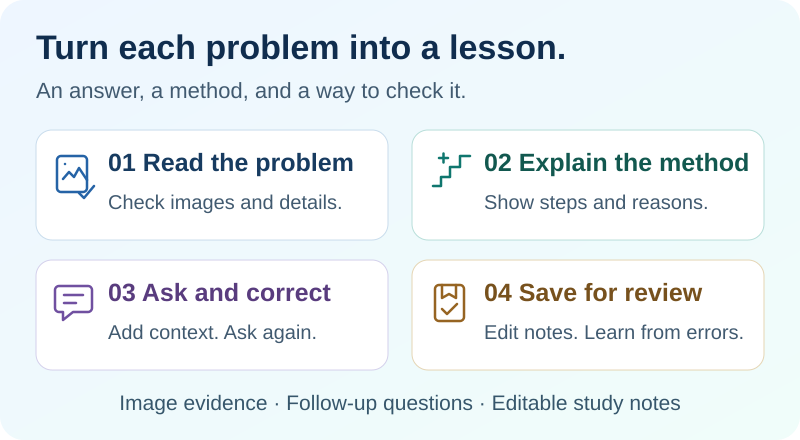
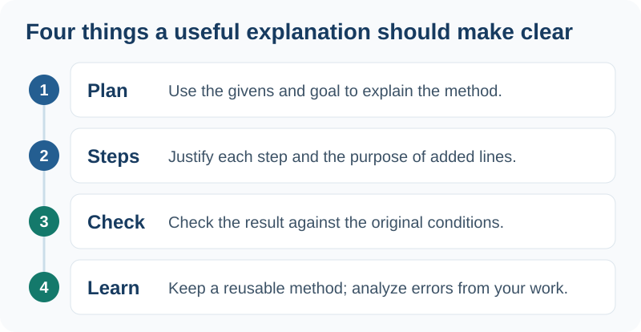

# SolvNote · AI Problem Solving & Learning Notes

[简体中文](README.md) | **English**

**Live demo**: [solvnote.n29.net](https://solvnote.n29.net/) (a public demo instance; availability and data persistence are not guaranteed.) Use only non-sensitive sample problems; do not configure your own AI keys or save sensitive material there.

**More than an answer from a photo: understand the method, why it works, and how to solve it yourself next time.**

A continued-development fork of [wttwins/wrong-notebook](https://github.com/wttwins/wrong-notebook). It keeps accounts, subject notebooks, image cropping and uploads, topic tags, practice, and printing, while extending image-based explanations, follow-up Q&A, geometry diagrams, and portable AI settings.

[Explanations](#explanations-not-just-answers) · [Get started](#get-started) · [Deploy](#deployment) · [Troubleshooting](#troubleshooting) · [Technical docs](#technical-docs-and-attribution)



## Explanations, not just answers

The goal is not another answer in a chat window. It is to bring together **checkable problem statements, understandable explanations, follow-up questions, and editable notes for later review**.

|What you want to know|How this project helps|
|---|---|
|Why take this step?|Start with the approach, work through titled steps with reasons, then check and summarize. An explanation should be more than a list of calculations.|
|Is there a more accessible method?|Grade level guides the explanation, not the ceiling on knowledge. Prefer the least advanced method that rigorously solves the problem; do not default to coordinates when elementary geometry is sufficient. Explain new concepts when a higher-level method is necessary.|
|Was the diagram read correctly?|Keep the original image for checking. Image-capable solving models receive it alongside the transcription. Re-read uncertain details before asking for missing information; human corrections take precedence.|
|What if I do not understand or disagree?|Ask follow-up questions, add images, or correct details within the same problem. The default is 10 rounds; administrators can change the default and explicitly add rounds after a limit warning.|
|How can I learn from the mistake?|Distinguish between being unable to solve it, an incorrect attempt, and an unassessed attempt. Keep your original work and edit the mistake analysis and topic tags. Do not invent personal mistakes without evidence from your work.|



**The problem, reference answer, and explanation have separate sections, with Markdown and math previews shown by default. Expand the source only when needed.** Edit the result and add it directly to your notebook, without moving text between a chat window and a separate editor.

<details>
<summary>See the interface: math formatting, step-by-step explanations, and mistake notes</summary>


</details>

> The two diagrams above illustrate the workflow and explanation structure; they are not screenshots. Interface screenshots use synthetic examples and show the Chinese UI. These explanation rules do not guarantee correctness: check the problem statement, derivation, and diagrams yourself.

## Two practical features

|Geometry diagrams: see the construction|AI settings: one connection, multiple models|
|:---:|:---:|
|||
|Reveal added points and lines step by step, alongside the original image.|A website/API endpoint plus one API key defines a connection; its models sit underneath it.|

- **Auxiliary lines and demonstrations**: after solving, choose to generate a step-by-step construction plan. AI creates the plan; the browser draws the base diagram and added lines, including circles, arcs, and sector boundaries. Download SVGs or open GeoGebra on demand. Viewing, changing steps, and downloading do not make additional AI calls. To add lines to a copy of the original image, an administrator can separately enable a supported Gemini image-editing model. The original is never overwritten; check the generated result.
- **Mix and match models**: configure separate orders for image reading/re-reading and solving/Q&A. Text-only models can still solve problems. Administrators manage connection dialogs, floating save controls, connectivity tests, duplicate detection, and encrypted settings import/export compatible with ScanDex.
- **Visible calls and recoverable tasks**: see the model, connection, image attachment, and elapsed time for each step, not private chain-of-thought. Once the backend accepts a task, you can leave the page. Retrieve short-task results, including auxiliary diagrams, in a dialog under My AI Tasks instead of paying to regenerate them.

## Get started

1. **Configure AI**: as an administrator, open `/admin/ai`. Add connections and models manually, or import an encrypted ScanDex configuration. Enable image input only for models that actually support it, add models to the relevant call orders, and save. A connectivity test makes one short text request and may incur a charge; it does not verify image-reading quality.
2. **Submit a problem**: upload and crop an image from the home page or a subject notebook's add page. You can also enter text or add instructions. The default reads the image before solving; text-only input skips image reading. Direct image-and-text solving remains available.
3. **Check and ask**: review the transcription, angle names, and conditions, and correct errors yourself. Ask about any unclear step or supply your own attempt. Generate an auxiliary-line plan on demand for geometry demonstrations.
4. **Organize and save**: edit the problem, answer, and explanation; set the attempt status; record your incorrect work, mistake analysis, and topic tags. Save to a notebook, then organize by subject, practice, or print for review.

**Default image workflow**: a vision model transcribes → a model is selected in solving order, with the original image attached if supported → uncertain image details are re-read first → genuinely missing information is requested from you → the explanation is completed. A text-only solver sends specific questions to a vision model; a multimodal solver can recheck the image itself. This does not call every configured model at once.

**Solving records and statistics**: a dedicated home entry lists accepted conversations and direct solves with status filters, pagination and live refresh. Follow-ups stay in one conversation; saving to a notebook remains a separate choice. Statistics distinguish solving, notebook entries and review practice. Completion is not correctness. AI attempt counts cover stored logs, not billing or lifetime totals. Surviving legacy records remain available; purged historical tasks cannot be recovered.

**Announcements**: administrators use `/admin/announcements` to manage drafts, publication, hiding, archiving, independent pin order and optional time windows. All active signed-in accounts receive these site notices. Explicit acknowledgement is per account: ordinary notices move to history, read-and-hide notices disappear only for that reader, and persistent notices stay without an unread badge. Opening the list is not acknowledgement. Editing or republishing does not reset reads; create a new notice to notify everyone again. List actions allow pin/unpin and hide/republish. Permanent deletion requires confirmation and removes the notice and its read receipts; use hide or archive to retain them. Content is plain text with optional English fields and same-site links; no email, browser or third-party push is sent.

**Announcement upgrade**: version `2.0.0-yus.2` adds `Announcement` and `AnnouncementRead` via an additive migration and transfers the three former built-in notices once. Deploy the matching schema, generated Prisma client and application together. Do not regenerate a dependency directory shared with a running instance. Stop writes and back up the database/configuration/original secrets before upgrading. Notebook JSON excludes notices and read receipts. See [announcement operations](docs/announcements.md).

**Backup boundary**: notebook JSON export excludes solving conversations, AI tasks and AI credentials. For a full backup, stop writes and preserve the database, configuration and original secret variables (including the master key) together; see the upgrade section below. See [CHANGELOG](CHANGELOG.md) or About → Version notes in the app. A source version does not imply a published container image.

> **What is saved**: same-problem conversations, direct solves and reanswers are retained long-term; temporary drawing and practice-generation results are retained for 24 hours. Leaving a page does not automatically save your manual editor draft. Save constructions to a notebook or download them for long-term retention. AI processing sends your submitted images, text, and necessary context to the providers you configure; avoid unrelated personal information.

## Deployment

**Image for this fork** (AMD64 and ARM64):

```text
ghcr.io/yumumao/solvnote:latest
```

### Zeabur: fresh installation

1. Create a container service using the image above and set its service port to `3000`. Attach a domain and enable HTTPS. Use **one continuously running replica**, without request-based sleeping.
2. Add two persistent volumes. Names can vary, but **the mount paths must be correct**:

   |Suggested volume name|Mount path|Contents|
   |---|---|---|
   |`solvnote-config`|`/app/config`|Configuration files and the AI encryption master key|
   |`solvnote-data`|`/app/data`|Database, accounts, saved problems, AI configuration, and tasks|

3. Set the following environment variables on the service. **Replace the example domain, email address, and angle-bracket placeholders before deploying.**

   ```dotenv
   NEXTAUTH_URL=https://solvnote.n29.net
   NEXTAUTH_SECRET=<replace-with-a-new-random-value>
   INITIAL_ADMIN_EMAIL=you@example.com
   INITIAL_ADMIN_PASSWORD=<replace-with-a-unique-password-of-at-least-12-characters>
   DATABASE_URL=file:/app/data/dev.db
   ```

   Generate `NEXTAUTH_SECRET` in a local terminal with Node.js installed, then copy the output into the platform's secret variable. Do not send it to an AI or commit it to Git. Alternatively, use `openssl rand -hex 32` where OpenSSL is available.

   ```sh
   node -e "console.log(require('node:crypto').randomBytes(32).toString('hex'))"
   ```

4. Deploy, then open `https://your-actual-domain/login`. Sign in with the email and initial password you configured, open `/admin/ai`, and test with a non-sensitive problem after setting up your models.

`NEXTAUTH_URL` must match the **scheme, host, and port** used in your browser. Do not enter the ScanDex address, a container address, or a `/login` path. Normally, leave `AI_CONFIG_MASTER_KEY` unset: the key is generated and stored at `/app/config/ai-master.key`. **Do not set `AI_WORKER_DISABLED=1` or copy a local-machine proxy setting into Zeabur.**

<details>
<summary>Self-hosting: start this fork with Docker Compose</summary>

After deployment, open `https://solvnote.n29.net/login` (or your actual domain) and sign in with the email and initial password above. Then open `/admin/ai` to configure models and test with a non-sensitive problem.

For a new installation, install Docker with Compose and create `.env.solvnote` in a new directory using the variables above. For local testing only, set `NEXTAUTH_URL=http://localhost:3000` and always use that exact address in your browser. Public access requires a separately configured HTTPS reverse proxy.

In the same directory, create `compose.solvnote.yml` with the contents below. The repository's `docker-compose.yml` already uses the SolvNote image; you may also create the example file below.

```yaml
services:
  solvnote:
    image: ghcr.io/yumumao/solvnote:latest
    restart: unless-stopped
    ports:
      - "3000:3000"
    env_file:
      - .env.solvnote
    environment:
      DATABASE_URL: file:/app/data/dev.db
    volumes:
      - ./config:/app/config
      - ./data:/app/data
```

Run these commands from that directory:

```sh
docker compose -f compose.solvnote.yml pull
docker compose -f compose.solvnote.yml up -d
docker compose -f compose.solvnote.yml logs --tail=100
```

Open `http://localhost:3000/login` to sign in. `.env.solvnote`, `config`, and `data` are private deployment files. Back them up securely and never upload them to a public repository.

</details>

### Existing deployment: upgrade safely

1. **Stop application writes and back up `/app/config` and `/app/data` together.** Record the old image digest and environment variables. A database backup alone cannot restore encrypted content.
2. Confirm the target version was published in the [image workflow](https://github.com/yumumao/solvnote/actions/workflows/build-docker.yml), then have the platform pull the new image and redeploy. **Keep the existing volumes, database path, and secrets. Do not recreate the database or replace the master key.** A README-only change does not require an image update.
3. Migrations run at startup. Bootstrap variables do not reset existing administrators. Sign in through the canonical site address, then check AI settings, image-based solving, and task recovery.

To roll back, stop the application and restore **the old image, the paired volume backups, and the original environment variables** together. Do not let old code write to an upgraded database. See the [deployment and build guide](docs/deployment-build.md) for detailed troubleshooting (in Chinese).

## Troubleshooting

|Issue|What to do first|
|---|---|
|Import reports `IMPORT_ORIGIN_REJECTED`|Check the site's address diagnostics in `/admin/ai`. Match `NEXTAUTH_URL` to the browser address, redeploy, and sign in again. ScanDex may use a different address; re-entering the file passphrase cannot fix an origin mismatch.|
|Administrator initialization fails at startup|Read the **first error before this summary message**. A new database needs an initial password of at least 12 characters. For an existing installation, check the `/app/data` mount and database path first; do not delete volumes or blindly reset accounts.|
|A model immediately returns `AI_ENDPOINT_REJECTED`|Cloud deployments accept only public HTTPS endpoints. Check the URL and DNS. Do not use local proxies or private-network addresses as cloud AI endpoints, or disable the security checks.|
|Analysis takes a long time, or acceptance is unknown|Open My AI Tasks to inspect the stage and error. Requests marked `unknown` are not automatically resent, to avoid duplicate charges. Check provider records before resubmitting. Image reading, solving, and any necessary re-reading are not equivalent to one chat request; faster completion is not guaranteed.|
|An auxiliary diagram is missing or you left the page|Within 24 hours, retrieve the short task from My AI Tasks and view it in the dialog. Do not regenerate merely to fix a display issue. The SVG is a reconstructed schematic, not a pixel overlay on the original; use the original image for complex shading.|
|You want to back up or transfer AI settings|An administrator must save settings before exporting an encrypted file; preview imports before confirming. Use a separate passphrase of at least 12 characters, and keep it apart from the file. The file contains provider credentials, not problems, accounts, or deployment settings.|

## Technical docs and attribution

The following detailed guides are currently in Chinese:

- [Image reading, solving, and targeted re-reading](docs/ai-image-pipeline.md) · [Follow-up Q&A, round limits, and human clarification](docs/ai-dialogue-roadmap.md)
- [Notebook editing and explanation rules](docs/notebook-editing.md) · [Auxiliary lines, image editing, and task dialogs](docs/ai-drawing.md)
- [Encrypted AI configuration exchange](docs/portable-ai-config.md) · [Deployment, builds, and troubleshooting](docs/deployment-build.md)

Built with Next.js, React, TypeScript, Prisma, and SQLite. Background tasks require a continuously running Node.js process; pure serverless functions and multiple hosts sharing SQLite are not supported deployment targets. The deployment branch is [`main`](https://github.com/yumumao/solvnote/tree/main). This repository does not currently provide a desktop installer.

**Upstream credit**: [wttwins/wrong-notebook](https://github.com/wttwins/wrong-notebook), its original author, and contributors. This is a continued-development fork; features described here are not necessarily present upstream. The upstream README stated MIT, but no standalone LICENSE file was found in the upstream and current snapshots reviewed. This fork does not add a license or grant additional rights; verify the upstream license terms before redistribution or commercial use.
