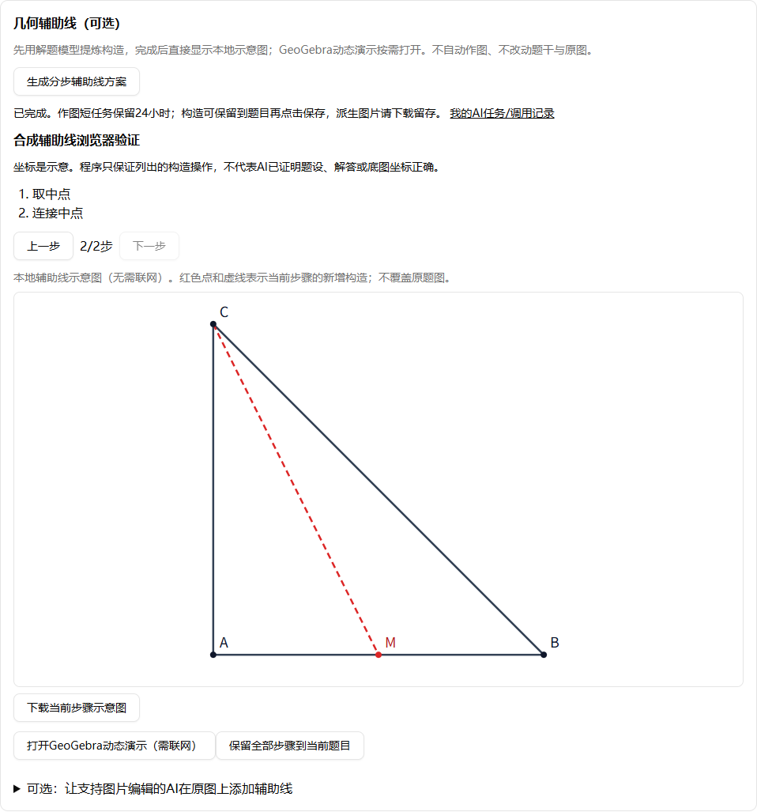
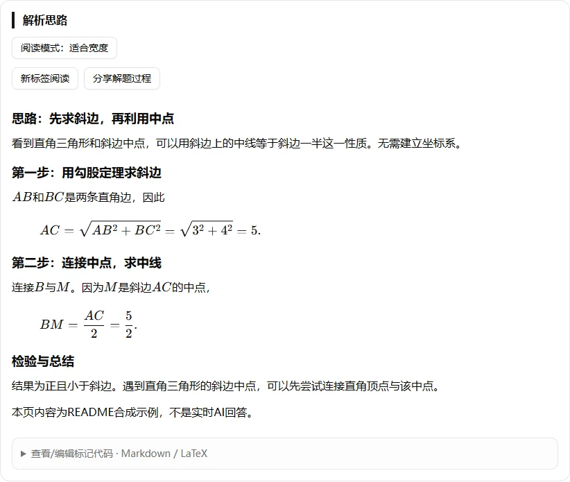
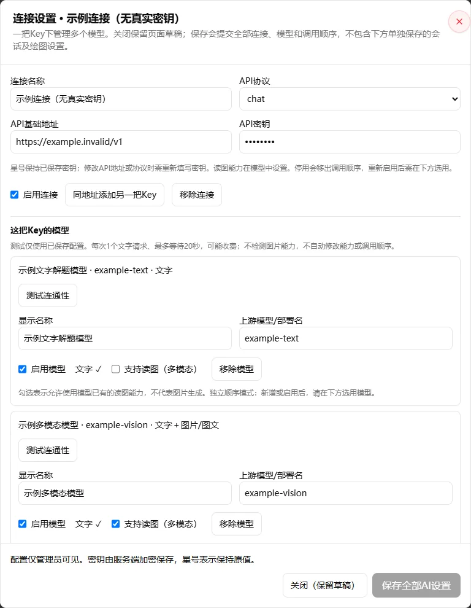

# 错题本·YUS继续开发版

基于[wttwins/wrong-notebook](https://github.com/wttwins/wrong-notebook)继续开发的AI错题整理与解题网站。保留原项目的账户、学科错题本、裁剪上传、知识点、练习和打印等能力，本分支重点改进AI配置互通、图文解题、长任务可靠性和容器发布流程。

> 这不是从零原创的项目。感谢上游作者及贡献者。文末说明来源与许可核实情况。
>
> 2026-09更新：同题多轮问答、图像疑点补读、完整错题编辑与分步辅助线预览。本地识图解题和辅助线显示已由使用者验证；线上更新后仍需检查实际模型和部署环境。AI答案与几何示意图请人工核对。

## 本分支新增与改进

- **两层AI配置**：连接管理地址、协议和独立Key，同一连接下配置多个模型及文字/读图能力；分别设置解题/问答顺序与识图/补读顺序，同一模型无需重复配置。支持Chat Completions、Responses、Codex Responses、Gemini原生接口、Azure部署。
- **设置操作便利性**：点击连接名称或设置图标打开弹窗，模型直接放在所属连接下；弹窗内固定保存、主页面底部悬浮保存栏保留未保存提示。模型可显式测试已保存连接，最多20秒、单次短文字、不发送题图、不回退重试，可能产生费用。
- **检测与合并**：服务端比较同地址真实Key，管理员预览重复连接/模型并选择保留项；冲突默认分开，确认后才保存，不泄露密钥或自动改变模型能力。
- **与ScanDex互通**：管理员可导入ScanDex导出的加密AI配置，先解密预览，再选择合并或替换；也可用独立口令导出错题本已保存配置，继续使用portable-ai-config v1格式。普通用户和匿名访客不能查看、修改、导入或导出凭据。
- **站点地址诊断**：管理员AI设置页对照浏览器地址与后台NEXTAUTH_URL，给出Zeabur反向代理部署提示；不再把同源拒绝误当作文件口令错误，也不关闭安全校验。
- **保留题图**：支持文字、图片、补充文字＋图片，以及先转录再带图解题。请求可以压缩，原裁剪图保留供核对和恢复；几何题不能仅靠OCR描述替代原图。
- **可选第二模型复核**：复核按解题顺序选择不同模型，支持读图时附图，并与前序步骤共享调用预算。至少需要两个可用模型；不是无限重试，也不是默认同时调用所有AI。
- **同题持久会话**：首页与错题本添加页默认先识图再解题；疑点优先定向补读，缺条件时停下来问你。保存补充可不调用AI，等待人不占worker或活动时间；完成后可继续追问。
- **图示理解与澄清**：角弧、直角框、等长刻痕等清晰标记无需文字重复定义；识图阶段的缺失判断先交解题者核对，图像疑问优先一次定向补读。真正缺少材料或需要用户选择时才直接询问，不强迫模型编造答案。
- **几何证据核验**：识图结果可携带编号角、顶点、两条射线和局部区域证据；对∠1等关键角先用原图局部裁剪独立核验，核验失败时暂停而不是带着错误角名继续解题。用户可完整替换转录，人工版本优先于机器事实和旧核验。
- **辅助线与图片编辑**：优先生成受约束的点、线段、中点、垂足、旋转和交点构造，直接显示本地SVG，支持分步预览、下载、保存到错题和按需打开GeoGebra；管理员可额外明确启用Gemini图片编辑模型，把辅助线作为派生示意图叠加到副本，原图永不覆盖，生成图需人工复核。
- **调用过程可见**：逐步显示实际模型、所属连接、任务阶段、是否带图、耗时及人工确认；新记录细分JSON/字段校验、空正文、仅思考字段、输出截断和响应头前/正文读取阶段的超时，不保存原始失败响应，不展示内部思维链或Key。
- **识图响应兼容**：接受JSON前已闭合的思考标签；几何裁剪坐标只是可选提示，无效时保留有效转录并用完整原图核对。角的顶点、射线和编号仍严格验证，不为通过校验擅自改题；兼容修复不代表所有模型均能正确、快速识图。
- **轮数与费用边界**：默认10轮，首次完成计1轮，澄清/补图不另扣轮数；每轮还有独立调用数和活动时间限制，管理员需明确确认才能扩额。
- **保留旧式短任务**：旧式直接解题、转录解题和既有任务恢复仍可使用；刷新、关页不等于取消。
- **正确性优先**：年级影响讲解方式，不是知识禁区。例如五年级用户问初中题，允许使用初中方法，说明新增概念和推导；不能为了符合年级给出错误答案。旧式解题的自定义提示词同样受正确性规则约束；新多轮会话采用独立JSON提示词，不会直接套用旧XML模板。
- **安全与部署**：AI配置、任务与会话内容、人工回复及调用身份快照在SQLite中加密；修补AI管理端点权限与外部URL访问边界；GHCR双架构改为原生并行构建。

## 界面预览

以下为Chrome在隔离测试环境中的实际界面截图。题目、解答、连接名称和构造结果均使用合成演示数据，不含真实账号、Key或用户题图，也不代表某个模型的实际输出质量。

### 分步辅助线：默认本地显示，可下载



### 数学公式与错因：预览优先，标记源码按需查看



### 连接弹窗：一个连接配置多个模型



## 加密备份与同源报错

在`/admin/ai`先保存修改，再点击**导出配置**，输入两次独立口令（12至1024字符），下载`.aiconfig.enc.json`文件。只导出已保存的AI连接、Key、模型能力和调用顺序，不含题目、账户、主钥或部署配置。文件和口令分开保管，不要提交公开仓库。错题本在服务端加密，线上必须使用HTTPS；文件上限1MiB。

`IMPORT_ORIGIN_REJECTED`发生在读取文件前，换一个导出来源或重新输入口令不能解决。展开设置页的**站点地址检查**，对照浏览器页面地址与NEXTAUTH_URL；若确实使用正式域名，在Zeabur配置同样的协议、主机和端口，保留两卷重新部署后重新登录。ScanDex和错题本可以使用不同地址。详细步骤见[部署说明](docs/deployment-build.md)。

## 主线与容器镜像

本仓库的部署主线是[`main-yus`](https://github.com/yumumao/wrong-notebook-yus/tree/main-yus)。正式镜像地址：

```text
ghcr.io/yumumao/wrong-notebook-yus:latest
```

镜像同时面向`linux/amd64`和`linux/arm64`。`latest`只在两种架构构建、真实容器启动检查及manifest检查均通过后更新；合并代码不等于镜像已经发布，请在[Actions](https://github.com/yumumao/wrong-notebook-yus/actions/workflows/build-docker.yml)确认对应提交的发布结果。需要可重复部署时，使用该次发布的`sha256`摘要固定镜像，而不是长期依赖浮动标签。

Zeabur升级前请配对备份`/app/config`与`/app/data`两个卷，保留原环境变量和管理员账户；不要删除卷或重新初始化真实数据库。部署步骤及回滚边界见[部署与构建说明](docs/deployment-build.md)。

## AI配置的使用方式

1. 管理员登录，打开设置中的AI配置入口，或访问`/admin/ai`。
2. 添加供应商、协议、HTTPS接口地址、API密钥与模型；或者在ScanDex管理员AI设置中导出加密文件，再到这里导入。

   ScanDex须包含本分支对应的加密导出功能，且运行中的后端已加载新版本；只更新静态页面不会让旧后端自动获得导出接口。
3. 连接层填写协议、HTTPS地址和独立Key；同地址可添加不同Key连接。同一连接下添加多个模型，分别勾选文字/读图能力。分别选用并排序解题/问答模型和识图/补读模型；读图能力与任务选用分开，添加模型后需要明确加入对应顺序。导入时保留原两链的成员和顺序，不自动把原先排除的模型加入。声明读图能力不会让纯文本模型自动具备识图能力。
4. 先预览导入内容，再确认合并或替换。合并以相同ID的导入项覆盖，导入链顺序优先；替换只替换AI配置，不改用户、题目和其他设置。
   保存按钮固定在屏幕底部。展开连接和模型后可点击**测试连通性**，需先保存且启用连接及文字能力；确认后才发送请求。成功只代表当次文字通信，不代表读图能力或解题质量；失败/超时不自动重试，先核对供应商记录。
5. 如有重复项，先保存编辑，再点击**检测与合并**。检测只比较服务端已保存的真实Key，不调用AI、不写配置、不返回密钥或可复用指纹。同地址不同Key仍保留为独立连接；完整地址、协议、API版本和非空真实Key均相同才建议合并。
6. 在预览中选择保留哪个连接/模型，或保持分开。同连接按实际模型/部署名去重，不按显示名称。能力或启用状态有冲突时默认分开，不自动取能力并集；修改选择后必须重新预览。
7. 核对合并前后两类任务顺序，再确认应用。引用会重映射，按各任务原顺序保留首次出现位置并去重，不自动加入新任务；选择停用或能力较少的保留项可能移除链成员。预览5分钟有效，配置版本变化后须重新检测。
8. 解题后人工核对题干、图形条件、答案与推导，再保存到错题本。

导出文件采用独立口令保护，至少12字符。口令与网站密码、API密钥不同，不保存在错题本。请分别保管文件与口令；加密文件仍属于敏感备份，不要放进公开仓库。

网站只允许公共HTTPS上游，不支持导入本机代理地址、内网AI服务或自定义请求头。出口会拒绝内网/保留IP、凭据型URL和重定向。**这与本地ScanDex的网络边界不同**，不是复制本机所有设置。

本地代理的Fake-IP模式可能让公网域名解析成`198.18.x.x`，造成所有模型立即报`AI_ENDPOINT_REJECTED`，请求实际尚未发送。需要本地代理时，由运行服务的人显式设置`AI_LOCAL_HTTPS_PROXY`为可信的回环HTTP代理地址；仅设置`HTTP_PROXY`/`HTTPS_PROXY`不会改变AI安全出口。此模式通过固定的公共DoH服务取得真实地址，检查所有结果均为公网，再将代理CONNECT固定到已检查的IP，同时保留原域名的Host和TLS证书校验。不会放行虚拟IP或内网目标，不更改模型顺序。**Zeabur通常不要设置此本地选项**；代理不属于AI交换文件。配置、信任边界和排障见`docs/deployment-build.md`。

协议、白名单与后续消费者约定见[AI配置交换格式](docs/portable-ai-config.md)。

### 导入报错排查

连接/模型合并功能没有升级交换格式，仍使用`portable-ai-config v1`。不要仅凭旧版通用提示认定口令错误。

- `IMPORT_CONFIG_INCOMPATIBLE`：口令验证已通过，但配置校验失败；界面只显示字段位置与固定原因，不回显URL、Key或字段原值。例如`providers.0.baseUrl`指第1条连接地址。
- ScanDex本地可导出的HTTP、带查询参数等地址不一定符合云端策略；即使停用也会校验。请核对对应连接，本站不会自动转HTTPS、删除查询参数或丢弃条目。模型显示名称支持200字符，与实际模型名上限一致。
- `IMPORT_ORIGIN_REJECTED`：检查的是**错题本页面地址与错题本后台的`NEXTAUTH_URL`**，不是ScanDex地址或导出文件来源。两项目可以在不同域名、不同端口。本站协议、主机和端口须一致；本地`localhost`和`127.0.0.1`不能混用。该错误发生在读取导入文件之前，与口令无关。修正地址后重新登录并预览，不能通过关闭同源保护解决。401/403还须核对管理员权限。
- `AI_MASTER_KEY_MISSING`、`AI_MASTER_KEY_INVALID`或`IMPORT_STORAGE_UNAVAILABLE`：检查持久卷、权限、数据库迁移及配对主钥，不要删除数据库或生成新钥覆盖旧钥。
- `CONFIG_CONFLICT`、`IMPORT_PREVIEW_INVALID`：重新预览；确认导入时若网络超时，先刷新核对是否已保存，不要重复提交。
- 仍显示旧版笼统提示时，确认运行中的错题本后台已更新。排查只需错误代码及发生在预览还是确认阶段，**不要发送导出文件、口令、API密钥或完整网络日志**。

## 识图与解题流程

首页和错题本添加页默认使用同题会话，不依赖本机OCR：

1. 有图片时，按识图/补读顺序转录题干、图形显式条件和不确定项；纯文字跳过此步。
2. 按解题/问答顺序发送文字；解题模型支持图片时同时附图，不支持时只发转录与上下文。
3. 关键图像疑点优先补读。文字解题者把具体问题交视觉模型，再由**原解题模型**续解；多模态解题者自己定向核图。每轮最多一次自动补读回环。
4. 原题缺图、缺条件、需人选择或补读仍不能确认时，暂停并请用户补充。可仅保存，不调用AI；点击继续才恢复当前轮。
5. 完成本轮后自动显示完整编辑器，可直接编辑并添加错题，也可继续追问。年级是讲解起点，正确解题优先并选择最低必要知识；新回复不会自动覆盖手动草稿。

几何关系不得根据外观或比例猜测。日常请求使用压缩副本；定向补读使用保留的原裁剪图，以免反复查看同一张丢失细小标注的压缩图。Responses收到完整完成事件即结束读取，不再等待连接关闭；不完整响应不能算成功。

先识图再解题通常至少2次调用；出现文字模型定向补读时通常至少4次。因此不承诺比ScanDex转录或单次直接解题更快。流程、定位依据与效率边界见[图片识别与解题流程](docs/ai-image-pipeline.md)。

## 几何角标、人工修订与辅助线

几何题的图片是题设证据的一部分。识图阶段同时提取完整题干、图上显式条件和关键编号角的结构化证据；必要时对原图局部裁剪、独立核验。自动核验不是正确性保证，用户可在完整转录编辑器中纠正角名与条件，人工修订优先。

### 如何使用辅助线

1. 解题完成后，在可直接编辑的结果区域找到**几何辅助线（可选）**，点击**生成分步辅助线方案**。这一步会调用解题模型并可能收费，不会自动执行。
2. 方案完成后直接显示**本地SVG示意图**，自动适配坐标范围。用上一步/下一步逐步查看新增点和红色虚线，也可下载当前步骤；查看、切换步骤和下载不额外调用AI，不依赖外部绘图服务。
3. 核对方案后，点击**保留全部步骤到当前题目**，再保存到错题本。需要可交互演示时，手动打开**GeoGebra动态演示（需联网）**；加载失败可重试显示，无需重新解题。
4. 如果希望直接在原题图副本上添加辅助线，管理员先指定受支持的Gemini图片输出模型。展开图片编辑选项、核对构造步骤并勾选确认后才可生成；此步骤会另行调用AI，派生图片可下载，**原图不会覆盖**。

结构化方案只接受点、线段、中点、垂足、旋转、交点等受约束操作，不执行AI自由文本中的任意绘图代码。普通多模态识图能力不等于图片编辑能力；本地示意图和AI派生图都不是证明，需核对点位、标注及新增线条。

修改题目或答案后，旧方案会提示失效，不能直接应用到新题设。作图短任务保留24小时，可从我的AI任务取回已有结果，不必因刷新或显示加载问题重复付费生成；需长期保留时请保存构造或下载图片。实现细节见[辅助线与图片编辑](docs/ai-drawing.md)。

## 完整错题结果与标记预览

- 首页、学科添加页及独立会话页均在首次完成后自动显示完整编辑器，不再需要取回操作。可直接选择不会做、做错了或未判断，直接输入错误解答原文和错因分析，增删知识点，再保存到错题本。
- 题目内容、参考答案、解题思路默认显示Markdown/LaTeX预览；标记源码按需展开，预览与编辑使用同一份文本。错误解答和错因文本框始终可见，公式预览可另行展开。历史AI回复折叠保留供对照。
- 刷新会话状态或发送追问不会覆盖当前已打开的人工草稿；新答案到达后可确认采用新回复，服务端再次核对版本和配对题图。会话历史已持久保存，但编辑器中的手动修改须点击保存到错题本；刷新整个网页、关闭或离开页面不会自动保存草稿。返回首页会提示这一差别。
- 解题讲解按思路、带具体标题的分步证明、检验与总结组织。优先最低必要知识，确有必要再逐级提高；能用初等几何严谨解决时，不为计算方便默认坐标法。辅助线、旋转、全等和相似需交代目的、对应条件与结论，不强套某道题的五步。无错误作答证据不编造个人错因。
- 辅助线方案完成后直接显示本地示意图，支持逐步查看和下载SVG，不依赖外部服务、不额外调用AI；GeoGebra动态演示按需打开，加载失败可重试显示而无需重新解题。
- GeoGebra仍在完整编辑器内，可手动生成并保存演示。查看与编辑不调用AI；点击生成演示或重新解答才走相应任务，可能收费，并非所有题目都适合演示。

旧版源码定位、图片链路差异与提示词兼容边界见[旧版对照与直接编辑](docs/notebook-editing.md)。连续回归的原因、当前修正与防回退检查表见[旧版与多轮解题回归审计](docs/ai-regression-audit.md)。升级不会自动重写历史答案；解题教学质量仍需结合实际题目人工核对。

## 长任务、超时与费用边界

- 默认全站单worker，最多30个待处理/运行中任务；每用户最多5个。等待人工答复的会话不在执行队列中占位。
- **同题会话**每轮默认6次上游尝试、600秒累计活动时间；识图、解题、回退、补读和复核共同消耗。暂停再继续不会清零，排队与人工等待不计入活动时间。
- 单次请求上限仍为180秒，并受当前轮剩余时间约束。时间与调用数是安全上限，不保证一定会用完。
- 管理员确认后可为当前轮追加4次调用及600秒；分别受18次/1800秒硬上限限制。扩额本身不调用AI，仍须手动继续。
- **旧式短任务**仍是最多3次尝试、600秒执行窗口，数据保留24小时。旧链行为不被会话改动偷偷替换。
- 会话持久保存，最多100个/用户，可显式删除；消息和上下文有大小上限，到限后明确停止，不静默截掉几何条件。删除会话不会删除已存入错题本的题目。
- 429按域名＋Key额度组冷却；网络/流中断、进程崩溃、完成后落库失败等受理状态不明时标记`unknown`，**不自动重发，也不提供原会话直接续发按钮**，避免重复收费。
- 取消尽力停止后续处理，无法保证撤销已受理请求或退费。关闭页面不等于取消。
- 过程模块展示事实性调用记录，不展示内部思维链；多模型和复核也不能保证答案永远正确。

仍可能因供应商排队、网络或响应格式错误而失败；本项目不承诺消除所有超时。管理员应先用小样本确认模型的JSON输出与图片能力，再扩大使用。

## Zeabur部署与持久化

继续使用现有两个卷，不需要换数据库：

|卷|挂载目录|用途|
|---|---|---|
|`wrong-notebook-config`|`/app/config`|旧配置文件、AI加密主钥|
|`wrong-notebook-data`|`/app/data`|SQLite数据库、账户、错题、加密AI配置及任务|

关键环境变量：

|变量|说明|
|---|---|
|`DATABASE_URL`|容器默认`file:/app/data/dev.db`，保持与原部署一致|
|`NEXTAUTH_URL`|实际HTTPS站点地址；不要填写示例域名部署|
|`NEXTAUTH_SECRET`|自行生成足够长的随机值，放平台秘密变量，不提交Git|
|`INITIAL_ADMIN_PASSWORD`|**仅首次无管理员时必需**，至少12字符；已有管理员不会被重置|
|`INITIAL_ADMIN_EMAIL`|可选，首次管理员邮箱默认`admin@localhost`|
|`AI_CONFIG_MASTER_KEY`|可选，32字节密钥的64位十六进制或base64；未设置时自动保存到`/app/config/ai-master.key`|
|`AI_CONFIG_DIR`|非容器环境可覆盖主钥目录；容器无需设置|

默认不再创建公开固定弱密码账户。已有旧安装请自行确认已修改默认密码；升级不会静默替换既有管理员密码。生产建议关闭不需要的注册，并使用HTTPS。

### 升级前后

1. **同时备份两个卷**，保持数据库与主钥匹配，并记录当前镜像标签/摘要。只备份数据库不能恢复加密内容。
2. 部署新镜像。入口脚本在启动前运行Prisma迁移，迁移失败立即退出，不吞掉错误继续启动。
3. 首次使用新AI配置时，从旧`config/app-config.json`迁移当前选中的供应商；旧OpenAI实例按原激活项优先排列。旧文件保留作为回滚来源，不删不覆盖。不兼容公共HTTPS等新契约的旧条目会跳过，管理员需在新页面补配或重新导入；不会为兼容旧条目而放宽网络安全边界。
4. 管理员检查模型视觉能力、接口地址和双链顺序。旧配置不包含精确视觉能力声明，需要人工核对。
5. 先用一条不含隐私的题目验证文字和视觉链，再验证任务页刷新恢复。

新AI配置以SQLite为准，不再通过旧设置页编辑AI凭据；提示词等非AI连接设置仍沿用旧配置文件。请勿把`AI_WORKER_DISABLED=1`留在运行环境中，它仅供构建和离线测试使用。

**主钥丢失或不匹配时停止解密，不自动替换主钥。**先恢复配对备份。不要直接删除数据库、主钥或手工重置加密列。回滚先停止应用，再恢复两个卷的配对备份及旧镜像，避免旧代码与新数据混写。

推荐Zeabur**单副本**，不按请求休眠。该worker依赖持续运行的Node进程，不适用于纯无服务器函数。数据库租约不代表已经验证跨主机共享SQLite多副本，暂不支持那种部署。

## GHCR构建

GitHub Actions的`Native Docker Build & Publish`工作流供手动发布与版本标签发布共用：

- AMD64使用原生x86 runner，ARM64使用原生ARM runner，并行构建，避免通过QEMU编译整套应用。
- 分架构缓存依赖与BuildKit层，两种架构成功后才合并并发布manifest。
- 构建时不创建业务数据库、不执行seed；启动容器时迁移和初始化。
- 排除本地数据库、密钥、导出包、日志、备份与开发私有目录；移除未使用的原生SQLite适配依赖。

冷缓存、runner排队、字体下载和镜像上传仍需时间，**没有把某个耗时数字作为保证**。第一次及第二次缓存命中的Actions耗时才是提速验收依据。详见[部署与构建说明](docs/deployment-build.md)。

## 本地开发与验证

建议Node22、npm，Prisma锁定5.22。复制`.env.example`为本地环境文件并填写自行生成的值，不使用真实生产库做开发。

```sh
npm ci
npx prisma generate
npx prisma migrate deploy
npm run dev
```

新安装管理员初始化需要先配置独立强密码，然后运行`node scripts/seed-admin.js`；可按需运行项目已有系统知识标签初始化脚本。不要将初始化输出、环境文件或测试数据库上传。

```sh
npm test
npx tsc --noEmit
npm run build
npm run lint
```

新增测试包含加密互通、管理员权限、协议图片载荷、队列幂等与租约恢复、图文多阶段、年级正确性、几何证据核验、人工转录版本保护、辅助线构造白名单、Gemini图片编辑适配和HTTP错误边界。集成测试只创建合成临时SQLite库，不连接线上数据，不调用真实AI。`src/__tests__/fixtures/scandex-portable*-v1.json`均是专门生成的公开测试夹具，不是用户设置。

发布流程在AMD64和ARM64上分别使用临时合成卷验证真实容器启动：新库初始化、保留管理员与双卷的再次启动、缺少初始密码时安全退出。容器关闭外部网络，不调用真实AI；任一检查失败都不会更新正式镜像标签。这仍不能代替Zeabur真实卷升级和供应商调用验收。

仓库原有全量ESLint债务单独列入验收记录，不把单元测试通过称作浏览器或部署验收。Zeabur和真实供应商调用需在部署阶段分别验证。

## 隐私与后续集成

`.gitignore`和`.dockerignore`覆盖`.env*`、本地配置、数据库/WAL、主钥、加密导出、`.bak`、`.codex`、`.claude`等。**忽略规则不能从已有Git历史中删除已泄漏内容**；发现泄漏时仍需撤销凭据并单独处理历史。

AI处理会将用户明确提交的题图、文字和必要上下文发送至管理员配置的供应商；不要上传无关个人信息。任务和会话内容加密不等于完整数据库加密，账户和已保存错题仍按原数据库模型存储。

已实现ScanDex加密导出与本项目管理员导入，交换格式保持portable-ai-config v1。desktop-search、ImgToDoc和家庭健康服务继续通过各自原有的ScanDex接口使用AI设置，无需为本次连接/模型两层设置重复保存供应商Key；消费端独立导入仅在确需脱离ScanDex运行时另行适配。**本仓库不提供安装器，不改动家庭健康服务**。交换格式不携带本机路径、代理、服务口令或组件安装选项，为今后可选模块安装、可选依赖与按平台保存凭据保留边界。

## 连接弹窗与识图兼容

AI设置按连接（网站/API地址＋一把Key）管理模型。点击连接名称或齿轮打开设置弹窗，模型名称、能力和连通性测试均在对应连接内；调用顺序留在主界面。主界面固定保存栏、弹窗独立滚动区和固定底部保存栏兼顾手机操作。关闭只保留页面草稿，不会自动保存；弹窗的保存提交全部连接、模型和调用顺序，不包含单独保存的会话轮数及图片编辑设置。

识图提示词使用可通过校验的JSON示例。辅助列表省略或为空不再让整份转录失败；没有来源的事实不伪造图像出处，几何角的顶点及射线仍严格校验。Chat/Azure识图请求使用流式接收，只接受明确完成的正文，不展示或保存模型思考文本；解题请求的模式不变。仍保留180秒单次上限及受理未知不自动重发的保护，不能据此保证真实供应商的速度或识图准确率。

## 同题多轮问答

默认最多10轮。首次得到完整答案计第1轮；主动追问并得到答案再计1轮；本轮澄清、纠错、补图和补读不另扣问答轮数，但AI调用仍消耗本轮预算。

管理员在AI设置页修改新会话默认轮数，已有会话保留创建时的额度。到限后先提示，管理员确认可追加问答轮数，硬上限100轮；不会自动无限对话。会话可从`/ai-tasks`恢复，结果自动进入完整编辑器；采用新回复时再次核对版本与配对原图，避免旧标签页覆盖人工修改。

新增SQLite迁移`20260924010000_ai_conversations`保存会话、操作幂等记录和默认轮数，并为任务增加关联。升级前配对备份两个持久卷，不要重建真实数据库。完整设计、权限与验收边界见[多轮问答与人工澄清](docs/ai-dialogue-roadmap.md)。

## 上游来源与许可说明

- 原项目：`wttwins/wrong-notebook`；本仓库：`yumumao/wrong-notebook-yus`。
- 本分支属于继续修改，原有功能、代码与设计归其原作者/贡献者；本README重点描述本分支变更，不代表上游也有这些特性。
- 上游README曾声明MIT，但本次核对的上游仓库及当前代码快照未发现独立LICENSE文件，GitHub许可字段为空。因此这里不擅自新增许可证，也不作额外再授权承诺；再分发或商用前请向上游核实许可范围。
